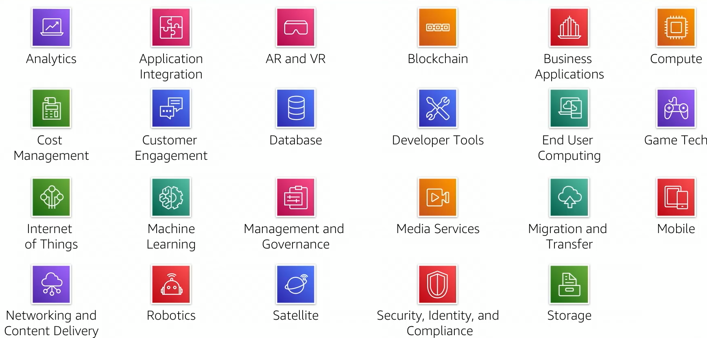
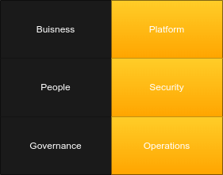

# Cloud Concepts Overview
## What is Cloud Computing
`Cloud Computing is the on demand delvery of compute power, database, storage, applications via the internet. 
`
* Run on server computers located in large data centers. 
* Located around the world. 
* Can be used together _"Like Building Blocks"_.

### Traditional Computing Model 
* Infrastructure as hardware.
* Hardware solutions: 
	* Require space, staff, physical security, planning, capital expenditure. 
	* Have a long procurement cycle. 
	* Require to to guess what peak usage will be and install infrastructure around that estimate. 
  
### Cloud Computing model 
* Allows you to think of infrastructure as software. 
* Software solutions:
	* Are flexible
	* Can cnage more quickly, easily and cost-effectively than hardware solutions. 
	* Eliminate the indifferentiated heavy-lifting tasks. 

### Deployment Models 
* The three main deployment models for cloud are: 
	* Cloud 
	* Hybrid
	* On-premises (private cloud)

## Advantages of Cloud Computing
1. Trade Capital exprense for variable expense.
	* Data center investment based on forecast. 
	* Pay only for the amount you consume.
2. Massive Economies of scale.
	* Lower Variable costs. 
	* Lower pay as you go prices. 
3. Eliminating guessing of capacity. 
	Guessing can lead to: 
	* Overestimated server capacity. 
	* Underestimated server capacity. 
	Cloud can lead to scaling on demand.
4. Increase speed and agility. 
	* Minutes Between wanting resources and having resources. 
5. Less Costs. 
	 *  No money spent on running and maintaining data centers. 
	 * Focus on projects which differentiate buisness. 
6. Go global in minutes. 
	* Can deploy application in multiple AWS regions around the world. 

## Amazon Web Service
### What are web services? 
`A web service is any piece of software that makes itself available over the internet and uses a standardized format(e.g JSON) for the request and response of an API.`

### What is AWS? 
* Aws is a Secure Cloud platform. 
* Offers a broad set of global cloud based products.
* On-demand access to compute, storage, network database and other IT resources and management tools. 
* Flexable. 
* Pay as you use. 
* Services work together. 

### Categories 

* Each service falls in a certain category. 

* The service you select depends on your buisness goals and technology requirements. 

### Interact with AWS
* There are three main ways to interact with aws: 
	* AWS Mangement Console 
	* Comand Line Interface (AWS CLI)
	* Software Development Kits (SDKs)

## Moving to the AWS cloud
* For many organisations, cloud computing offers many advantages over the traditional model. 
* Adoption can be a slow process. 
* An organisation consists of: 
	1. Technology 
	2. People
	3. Processes
* These factors must be in alignment for successful adoption. 
* Cloud computing introduces a significant shift in how technology is obtained, used and managed. 

### AWS Cloud Adoption Framework (AWS CAF)
* Provides guidence and best practices to organisations. 
	* To identify skills and processes. 
* Helps them nuild a comprehensive approach to cloud computing across the organisation. 
* Works throughout the IT lifecycle. 
* Aims to accelerate successful cloud adoption. 

CAF is organized into six perspectives: 

* Perspectives can cut across people, processes and technologies. 

|Focus on business capabilities|Focus On technical capabilities|
|---|---|
|Buisness|Platform|
|People|Security|
|Governance|Operations|

#### Business
* Stakeholders can use AWS CAF as strong case for cloud adoption. 

|Business perspective capabilities|
|---|
|IT Finance|
|IT strategy|
|Benefites realization|
|Buisness Risk Mangement|

#### People 
* Centres around **training, staffing and organisational changes**. 
* CAF can be used to evaluate structures and roles of organisation. 
* Performing an anlysis of needs and gaps can help prioritize training. 
* Help to build an agile organisation. 

|People perspective capabilities|
|---|
|Resource Management|
|Incentive Management|
|Career management|
|Training Management|
|Organisational change management|

#### Governance 
* Ensure that skills and processes align IT strategy and goals with business strategy. 
* Helps organisation focus on maximising value of IT services. 
* Helps minimize business risks. 

|Governance Perspective Capabilities|
|---|
|Portfolio Management|
|Program and project management|
|Business performance management|
|License Management|

#### Platform 
* Must understand and communicate nature of IT systems and their relationships. 
* Must be able to describe the architecture of target state environment in detail. 

|Platform Perspective Capabilities|
|---|
|Compute Provisioning|
|Network Provisioning|
|Storage Provisioning|
|Database Provisioning|
|Systems and Solution Architecture| 
|Application Development|

#### Security 

* Organisation must meet Security objectives

|Security Perspective Capabilities|
|---|
|Identity and access management|
|Directive Control|
|Infrastructure Security|
|Data Protection|
|Incident Response| 

