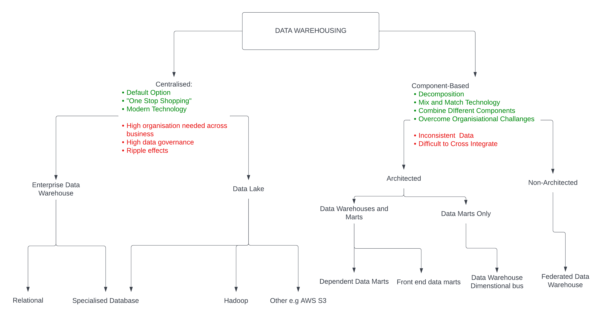
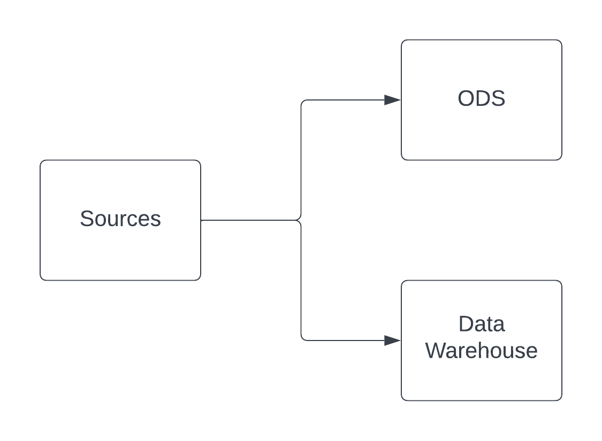
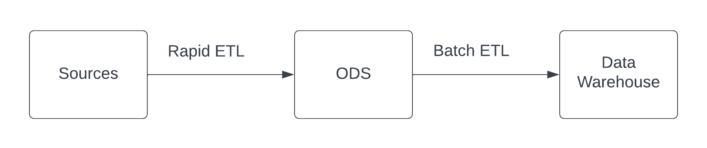
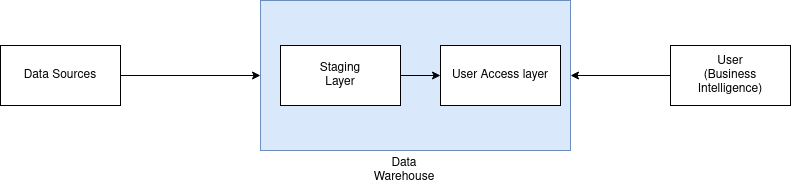

# Architecture

There are various approaches to data warehousing:

* Building a centralised warehouse (one central database). 
* Using data marts, smaller scale and more focused warehouses. 

## Centralised Data Warehouse

* One centralised data store is ideal 
* All sources will filter into one database. 
* Often very difficult to achieve. 

Some difficulties have been: 
*   Limits of technology.
*   Work processes.
*   Organisational and human factors.
 
* We now have techology that is able to handle this task. 
* Work Processes have now been improved in many businesses. 

## Data Warehouses vs Data Marts 

### Data Marts
* Like "Data Retailers". 
#### Dependant Data Marts
* Dependent data marts require a data warehouse.
* Dataware houses supply data to Dependant Data Marts 
* Architecturally Simple
* Uniform data across marts. 
#### Independent data marts 
* Doesn't need a data warehouse. 
* Draws data directly from source applications. 
* Data is organized dimensionally.
* Like a small scale data warehouse. 
* Little or no uniformity across marts. 
* Confusing architecture. 

### Independent Data Mart vs Data Warehouse

|Independent Data Mart|Data Warehouse|
|---|---|
|One or more Sources|Many Sources|
|ETL from sources|ETL from Sources|
|Possibly large data volumes|Possibly large data volumes|
|Dimensionally organised data|Dimensionally organised data|

## Which approach is the best fit? 

## Cubes
* Not a relational database. 
* Dimensionally aware.
* Leading Alternative for Data Warehouses.
* Mainly used for smaller scale Data Warehouses and Marts.

### Advantages and disadvantages
|Advantages|Disadvantages|
|---|---|
|Fast Query Response Time|Less Flexible data structures than Relational|
|Can handle decent amounts of data|More Vendor Variation|

### From a user perspective

* Try to abstract functionality to the user.
* Visualisation tools often used to hide cube functionality. 

## Operational Data Store(ODS)

* Integrates data from multiple sources 
* Focuses on current data
* Often uses a read time data source and added instantly
* Inform me of the state of data at that moment

### ODS's With data warehouses 

1. Have Parallel or separate feeds from sources
	* Users choose the ODS or Data Warehouse based on their needs
	* Strategic data pulled from Data Warehouse 
	* Operational data pulled from ODS

2. Send data to ODS and then to warehouse. 
	* Rapid ETL is performed between sources and ODS
	* Batch ETL is performed between ODS and Data Warehouse

### ODSs Today
* Less popular
* Data Warehouses are Faster and more up to date
* Superceded by big data
* There are some ODS components with data lakes
* Still can be found in critical situations. 

## Staging Layer
* There are two main layers in a Warehouse, a Staging layer and a User Access layer. 
* Landing Zone 
* A critical part of the extract part of ETL 
* 2 Variations, Persistant and Non Persistant

### User access layer
* Where Users go to access data 
* Dimensional data
* Data Flows from sources to the staging layer and then to the User Access Layer

### Warehousing architecture
   

### Non Persistant Staging Layer
1. Information is loaded into the Staging Layer from the source.
2. Data is then moved into the User Access Layer.
3. The Staging layer is then emptied. 

|Advantages|Disadvantages|
|---|---|
|Less storage space used|Need to go back to source to rebuild User Access Layer
|Data is already in User Layer|Data QA requires source systems|

### Persistant Staging Layer
1. Information is moved into the Staging Layer.
2. It is then moved into the User Access Layer.
3. Data is stored in the staging layer

|Advantages|Disadvantages|
|---|---|
|Rebuild User layer without source systems|More storage space used|
|Can compare staging and user access layer for testing|Risk of "Ungoverned access"|

