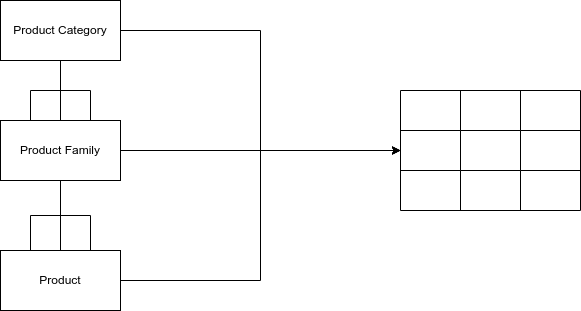
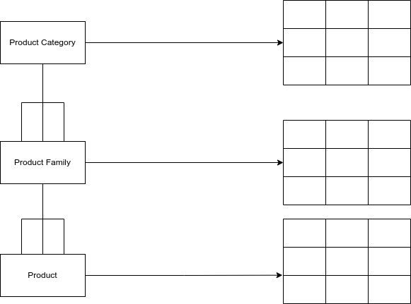

# Design Engineering

## How will the data warehouse be used
* The category of Buisness intelligence determines which data model will be used. 

|BI category|Data Model|
|---|---|
|Basic Reporting|Dimensional|
|Online analytical processing(OLAP)|Dimensional|
|Predictive Analytics|Data Mining/specialized|
|Exploratory analytics|Data Mining/specialized|

## Basic principles of Dimensionality

### Making data driven decisions 

To make data driven decisions, we need: 

*  One or more mesurements. 
*  Dimensional context for each mesurement. 

### Providing Dimensional Context

This is done with the terms: 

* By 
* For

To create the insight we use: 
* Measurement
* Dimensional Context

#### Typical Dimensional Insights
##### By
* What is the average annual faculty salary  by rank, by department, by academic year?
* What is the  average student loan balance  by major, by class year, by campus? 

##### For
* What is the  average annual faculty salary  for assistance professors, by department, by academic year? 
* What is the  average student loan balance  for engineering majors, by class year, by campus? 

|Wording|Usage|
|---|---|
|By| "Sliced and grouped" by values of the entire dimension|
|For|One or more specific values from within the entire dimension|

#### Implied Wording 
<em>"What is the average annual faculty salary  this academic year for assistant professors, by department."</em>

* No *by* or *for* before academic year. 
* We are asking ___for___ the academic year, not by the academic year. 
* ___For___ is implied. 

<em>"What is the total number of vacation days taken last academic year by administration employees."</em>

* Last academic year is an implied ___for___. 
* *"By admininstration employees"* sounds more natural than *"for administration employees"*. 

## Facts, Fact Tables, Dimensions, and Dimension Tables

In data warehouses:
* Measurements = facts
* Dimensional context = dimensions 

### Facts
* Numeric and quantifiable. 
* A measurement. 
* A metric.

#### Examples
* Salary
* Number of credits 
* Amount of money
* Number of years
 
* A fact is not the same as a logical fact. 
* When a relational database system is used, facts are stored in fact tables. 

### Dimension 
* A dimension is the context for a fact. 

#### Examples 
* Academic department
* Subject
* Student
* Employee
* Campus Building

  
* Dimensions are stored in a dimension table. 
* Dimension and dimension table are sometimes interchangeable. 

#### Star schema vs Snowflake schema

##### Star Schema 
* One dimension  created by combining three dimensions. 

##### Snowflake Schema 
* Each dimension has it's own dimension table. 
 

## Additivity 
Any data warehousing fact can be: 

* Addititve
* Non-Additive 
* Semi-Additive

### Addititve 
* An addtive fact can be added in all circumstances. 
* For example. salaries can add up to a total salary, and every time a new entry is added, that number can change. 

### Non Additive

* One example of a non-additive fact is an average grade. 
* You can't add for averages or a ratio. 
* Additivity relates solely to the *ability to add*

#### Deal with non-additive facts

* Store underlying components in fact tables. 
* Possibly store non additive fact for individual row. 
* Calculate aggregate averages, ratios from totals of underlying components. 

### Semi-additive facts

* Sometimes can be added.
* But sometimes can't be added.
* Typically used in periodic snapshot fact tables. 

## Star Schema vs Snowflake Schema 

|Star Schema|Snowflake Schema|
|---|---|
|All dimensions along a given heriarchy in one dimesion table|Each Dimension/dimensional level in it's own table|
|Only one level away from fact table along eatch hierarchy|One or more levels away from fact table along each hierarchy|
|With one fact table visually resembles a star|With one fact table visually resembles a snowflake|
"Denormalised" dimension table data|"Normalised" dimension table data

## Database Keys

### Fundamentals 

* Star and snowflake schemas implemented in RDBMSs. 
* RDBMSs use logical relationships to relate data across table.
* Any data can be related to any other data.
* "Oficial" relationships handled through keys.

### Key types

There are two main pairs of types of keys that are important to consider in an RDBMS.

1. Primary vs foreign keys.
2. Natural vs Surrogate keys.

#### Primary Key

* A primary key is a unique identifier for each row in a database table. 
* Could be a single database column(field). 
* Might require more than one database column. 

#### Foreign Key 

* A foreign key points to a primary key in another table. 
* It is used to indicate a logical relationship. 

#### Natural Keys

* Might be cryptic. 
* Might be understandable. 
* Travel from source systems with the rest of the data. 

#### Surrogate Keys

* No "buisness meaning". 
* Different than a "cryptic" natural key. 
* Generated by that database itself or a supplemental "key management" system. 
* Usually named with the format *"{table_name}_key"* eg *Student_key*

### Using Keys

* There are important decisions to be make when choosing how to use keys in a database. 

|Question/Decision|Guidance|
|---|---|
|Use Surrogate or natural keys as primary and foreign keys?|Add surrogate keys as data brought into data warehouse|
|Keep or discard natural keys in dimension tables?|Keep as "secondary keys"|
|Keep or discard natural keys in fact tables?|Answer not clear. Best option may be to discard natural keys| 

